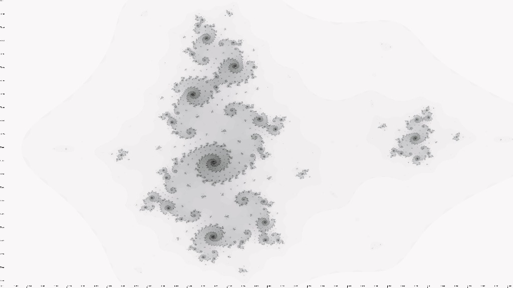

# Fractals

This is a simple project I worked on over the winter break between fall and winter semesters at the end of 2020. The goal was to simply create some julia set fractals. I did toy with Newton method fractals as well, hoever I have yet to refine the code for that method.

